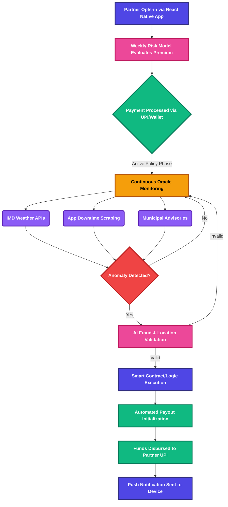

  
  <h1>Continuum</h1>
  
<em>A continuous sequence in which adjacent elements are not perceptibly different. Ensuring uninterrupted income flow, regardless of external disruptions.</em>

  
  
  

   

  **[Demo Video (Placeholder)](#)** &nbsp;|&nbsp; **[Pitch Deck (Placeholder)](#)**

---

## Executive Summary

**Continuum** is an AI-powered, parametric insurance platform engineered specifically for platform-based food delivery partners operating within the **Zomato** and **Swiggy** ecosystems. This platform provides a deterministic financial safety net against uncontrollable external disruptions—such as severe meteorological events, hyper-local application outages, and municipal curfews—that result in an immediate and unavoidable loss of daily wages. It is strictly scoped to **loss of income protection**, expressly excluding traditional indemnification models like vehicle repair, medical, or life insurance.

By leveraging real-time data oracles and edge-computed risk models, Continuum replaces subjective claims processing with automated, rules-based payouts. The platform utilizes a weekly micro-premium cadence, perfectly aligned with the gig economy's weekly payout cycles, ensuring high conversion and retention. Upon the validation of a predefined parametric trigger, payouts are executed autonomously, providing near-instant liquidity to delivery partners exactly when their earning capacity is disrupted.

## Target Persona & Scenarios

**Persona:** The Food Delivery Partner (Swiggy / Zomato Fleet)

* **Economic Profile:** Relies entirely on daily active hours for income. Highly sensitive to downtime. Operates on weekly aggregate payouts.
* **Operational Geography:** Hyper-local, constrained to specific municipal zones.
* **Risk Exposure:** 100% exposed to environmental, technological, and regulatory disruptions without traditional employment benefits.

### Scenario 1: Hyper-Local Application Outage

* **Disruption:** The regional Swiggy merchant order assignment API experiences a catastrophic 3-hour downtime during the peak Friday dinner rush.
* **Continuum Response:** Continuum’s oracle networks detect the downtime via Downdetector scraping and localized API latency checks. The anomaly is verified, and the parametric threshold is breached. Partner accounts active in the affected geolocation automatically receive a proportional wage-loss payout directly to their registered UPI wallets before the app is restored.

### Scenario 2: Severe Meteorological Event

* **Disruption:** A sudden, unforecasted torrential downpour and localized waterlogging in the partner's active delivery zone trigger a municipal "Red Alert," making physical delivery impossible.
* **Continuum Response:** The IMD Weather API oracle registers rainfall exceeding 50mm within a 2-hour window in the specific geographical polygon. The contract executes automatically, compensating the partner for the anticipated lost hours, allowing them to seek shelter safely without financial penalty.

## Parametric Triggers & Workflow

Continuum relies on highly deterministic data oracles to eradicate the claims investigation phase entirely.

### Primary Data Oracles

* **Meteorological:** API integrations with the India Meteorological Department (IMD) and hyper-local weather nodes to track rainfall volume, wind speed, and extreme temperature anomalies.
* **Technological:** Programmatic scraping of Downdetector and synthetic ping monitoring of Zomato/Swiggy delivery/order-routing APIs to detect systematic outages.
* **Regulatory:** Automated parsing of municipal advisory RSS feeds governing lockdown measures or localized curfews.

### System Workflow

## The Weekly Premium Model

Traditional insurance utilizes annual or monthly premiums, fundamentally misaligning with gig worker cash flows. Continuum enforces a strictly **Weekly Premium Cycle**.

* **Cash Flow Alignment:** Premiums are deducted on a timeline identical to the Zomato/Swiggy weekly payout cadence, abstracting the cognitive load of large upfront payments.
* **Dynamic Risk Rating:** The premium is recalculated every week using predictive modeling. For example, premiums marginally adjust based on the 7-day meteorological forecast for the partner's specific operating zone.
* **Micro-Transactions:** Payments are structured as high-frequency, low-denomination micro-premiums, reducing the barrier to entry to near zero.

## Platform Choice Justification

The user-facing application is fundamentally mobile-first, built using **React Native** and **Expo Go**.

* **Mobile-First Audience:** Food delivery partners exist entirely on mobile devices while operating. A web application is fundamentally inappropriate for this demographic and use case.
* **Critical Push Notifications:** Real-time push notifications are mandatory. When a disruption triggers a payout, the partner must be notified immediately over the lock screen to prevent them from taking unnecessary physical risks. React Native handles OS-level notifications efficiently.
* **Rapid Cross-Platform Prototyping:** Given the strict 6-week Devtrails Hackathon timeline, React Native combined with Expo Go allows simultaneous deployment to both Android (primary target) and iOS (secondary) from a single codebase, drastically reducing engineering overhead and time-to-market.

## AI & ML Integration

Continuum moves beyond static actuarial tables, deploying ML models for active risk assessment and platform security.

* **Dynamic Premium Calculation (XGBoost/LightGBM):** Hyper-local risk models consume historical delivery app downtime frequency, seasonal weather variance, and local traffic density to generate bespoke weekly premiums for specific delivery zones. A partner in a dense, flood-prone sector during monsoons will see a dynamically adjusted premium compared to a partner operating in a stable weather window.
* **Anomaly Detection & Fraud Prevention (Isolation Forests / Autoencoders):** To prevent exploitation (e.g., GPS spoofing into a payout zone during a known disruption event), the AI engine cross-references the partner's historical geographic ping data against their location during the disruption. If the trigger event genuinely impacted the user's habitual, verified operating zone, the payout is cleared; geographical anomalies are flagged and rejected.

## Tech Stack & Architecture

This implementation prioritizes speed to production, analytical capability, and reliability for the 6-week build phase.

* **Frontend:** React Native, Expo Go, Tailwind CSS (via Nativewind)
* **Backend Application:** Node.js / Express.js (REST architecture for low latency)
* **Database:** PostgreSQL (Relational integrity for financial ledgers) mapped with Prisma ORM
* **Oracles/Data Ingestion:** Python-based serverless functions (AWS Lambda/GCP Cloud Functions) for cron-based scraping (Downdetector / IMD APIs)
* **AI/ML Pipeline:** Python (Scikit-Learn, Pandas) deployed via generic FastAPI microservices for premium pricing inferences and fraud scoring
* **Payments Simulation:** Stripe / Razorpay Sandbox (for weekly premium auths and simulated UPI payouts)

## Development Plan (6-Week Execution)

* **Week 1: Architecture & Data Engineering**
  * Finalize database schema and core data structures.
  * Build Python ingestion pipelines for IMD and Downdetector data.
* **Week 2: Backend Core & Oracles**
  * Develop Node.js core services (User Service, Policy Service).
  * Implement the Oracle rule engine to parse incoming anomalies.
* **Week 3: ML Modeling & Pricing Engine**
  * Train base XGBoost pricing models on synthetic/open weather and downtime data.
  * Develop the fraud detection heuristic baseline.
* **Week 4: Mobile Application (React Native)**
  * Build out core unauthenticated and authenticated React Native flows using Expo.
  * Integrate the weekly premium subscription UI/UX.
* **Week 5: Workflow Integration & Notifications**
  * Connect the mobile frontend to the backend REST APIs.
  * Implement the automated payout triggers and push notification service.
* **Week 6: Quality Assurance, Polish & Pitch Prep**
  * End-to-end simulation of a localized disruption and payout.
  * Finalize UI polish, documentation, and prepare the hackathon submission video.

---

  <em>Proudly crafted for the Devtrails Guidewire Hackathon.</em>

