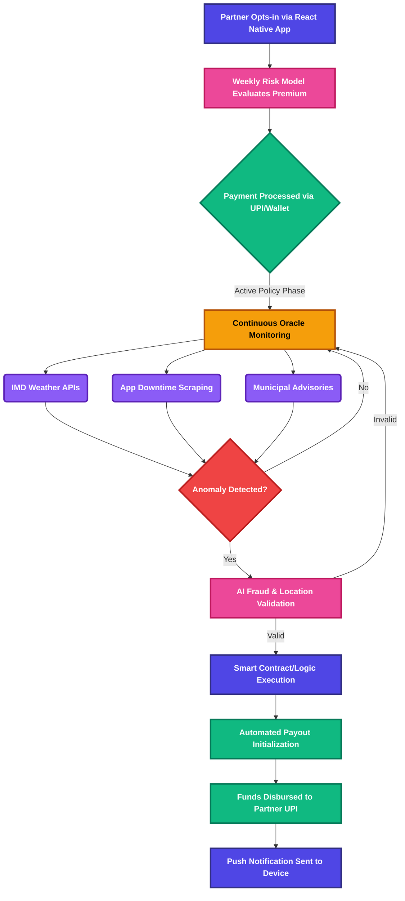

  
  <h1>Continuum</h1>
  
<em>A continuous sequence in which adjacent elements are not perceptibly different. Ensuring uninterrupted income flow, regardless of external disruptions.</em>

  
  
  
  

   

  **[Demo Video (Placeholder)](#)** &nbsp;|&nbsp; **[Pitch Deck (Placeholder)](#)**

---

## Executive Summary

**Continuum** is an AI-powered, parametric insurance platform engineered specifically for platform-based food delivery partners operating within the **Zomato** and **Swiggy** ecosystems. This platform provides a deterministic financial safety net against uncontrollable external disruptions—such as severe meteorological events, hyper-local application outages, and municipal curfews—that result in an immediate and unavoidable loss of daily wages. It is strictly scoped to **loss of income protection**, expressly excluding traditional indemnification models like vehicle repair, medical, or life insurance.

By leveraging real-time data oracles and edge-computed risk models, Continuum replaces subjective claims processing with automated, rules-based payouts. The platform utilizes a weekly micro-premium cadence, perfectly aligned with the gig economy's weekly payout cycles, ensuring high conversion and retention. Upon the validation of a predefined parametric trigger, payouts are executed autonomously, providing near-instant liquidity to delivery partners exactly when their earning capacity is disrupted.

## Target Persona & Scenarios

**Persona:** The Food Delivery Partner (Swiggy / Zomato Fleet)

Our core personas are grounded in primary user research conducted with active delivery partners, revealing massive income volatility and exposure to structural platform penalties:

* **The Power User (Sudarshan):** Works exhaustive 17-hour shifts (e.g., 45-50 orders/day) generating ~₹3,000 gross (₹2,100 net after fuel and food). Highly exposed to the platform's strict **₹250 penalty** for failed deliveries, disproportionately punitive given their operational volume.
* **The Full-Time Earner (Dakshina Moorthy):** Operates on grueling 15-hour schedules (8 AM - 11 PM), moving ~30 orders/day. They noted that platform penalties frequently equal or exceed the total earnings of a single order, highlighting a fragile risk-to-reward ratio.
* **The Part-Time Operator (Sudha):** Works focused 8-hour blocks for ~20 orders/day, earning ₹700-₹800. These participants specifically articulated a need for a deterministic safety net against generalized operational shutdowns, such as localized municipality strikes or severe urban waterlogging (floods).

* **Economic Profile:** Relies entirely on daily active hours for income. Highly sensitive to downtime. Operates on weekly aggregate payouts.
* **Operational Geography:** Hyper-local, constrained to specific municipal zones.
* **Risk Exposure:** 100% exposed to environmental, technological, and regulatory disruptions without traditional employment benefits, compounded by outsized punitive frameworks for unfulfilled orders.

### Scenario 1: Hyper-Local Application Outage

* **Disruption:** The regional Swiggy merchant order assignment API experiences a catastrophic 3-hour downtime during the peak Friday dinner rush.
* **Continuum Response:** Continuum’s oracle networks detect the downtime via Downdetector scraping and localized API latency checks. The anomaly is verified, and the parametric threshold is breached. Partner accounts active in the affected geolocation automatically receive a proportional wage-loss payout directly to their registered UPI wallets before the app is restored.

### Scenario 2: Severe Meteorological Event

* **Disruption:** A sudden, unforecasted torrential downpour and localized waterlogging in the partner's active delivery zone trigger a municipal "Red Alert," making physical delivery impossible.
* **Continuum Response:** The IMD Weather API oracle registers rainfall exceeding 50mm within a 2-hour window in the specific geographical polygon. The contract executes automatically, compensating the partner for the anticipated lost hours, allowing them to seek shelter safely without financial penalty.

## Parametric Triggers & Workflow

Continuum relies on highly deterministic data oracles to eradicate the claims investigation phase entirely.

### Primary Data Oracles

* **Meteorological:** API integrations with the India Meteorological Department (IMD) and hyper-local weather nodes to track rainfall volume, wind speed, and extreme temperature anomalies.
* **Technological:** Programmatic scraping of Downdetector and synthetic ping monitoring of Zomato/Swiggy delivery/order-routing APIs to detect systematic outages.
* **Regulatory:** Automated parsing of municipal advisory RSS feeds governing lockdown measures or localized curfews.

### System Workflow

## The Weekly Premium Model & Economic Logic

Traditional insurance utilizes annual or monthly premiums, fundamentally misaligning with gig worker cash flows. Continuum enforces a strictly **Weekly Premium Cycle** governed by a precise economic heuristic.

* **"The One-Order Rule":** Continuum’s core pricing logic dictates that the weekly premium must mathematically equal the approximate earnings of just 1 to 2 successful deliveries. For example, a ₹49-₹99 weekly premium aligns instantly with the cognitive model of a delivery partner, framing the safety net as the cost of a single missed order rather than a burdensome financial liability.
* **Cash Flow Alignment:** Premiums are deducted on a timeline identical to the Zomato/Swiggy weekly payout cadence, abstracting the cognitive load of large upfront payments.
* **Dynamic Risk Rating:** The premium is recalculated every week using predictive modeling. For example, premiums marginally adjust based on the 7-day meteorological forecast for the partner's specific operating zone.
* **Micro-Transactions:** Payments are structured as high-frequency, low-denomination micro-premiums, reducing the barrier to entry to near zero.

## Pricing & Tiers

To ensure optimal product-market fit across our diverse user profiles, Continuum offers a deterministic 3-tier weekly premium structure:

* **Silver (Starter):** ₹49/week for ₹500/day coverage. Built for the part-time operator (e.g., Sudha), mitigating risk for 8-hour shifts without over-insuring against baseline earnings.
* **Gold (Standard):** ₹99/week for ₹1,200/day coverage. The "Sweet Spot" optimized for standard full-time partners moving 20-30 orders daily.
* **Platinum (Pro):** ₹199/week for ₹2,500/day coverage. Engineered for high-volume power-users (e.g., Sudarshan) working 15+ hour days, ensuring robust income replacement during catastrophic localized outages.

## Platform Choice Justification

The user-facing application is fundamentally mobile-first, built using **React Native** and **Expo Go**.

* **Mobile-First Audience:** Food delivery partners exist entirely on mobile devices while operating. A web application is fundamentally inappropriate for this demographic and use case.
* **Critical Push Notifications:** Real-time push notifications are mandatory. When a disruption triggers a payout, the partner must be notified immediately over the lock screen to prevent them from taking unnecessary physical risks. React Native handles OS-level notifications efficiently.
* **Rapid Cross-Platform Prototyping:** Given the strict 6-week Devtrails Hackathon timeline, React Native combined with Expo Go allows simultaneous deployment to both Android (primary target) and iOS (secondary) from a single codebase, drastically reducing engineering overhead and time-to-market.

## AI & ML Integration

Continuum moves beyond static actuarial tables, deploying ML models for active risk assessment and platform security.

* **Dynamic Premium Calculation (XGBoost/LightGBM):** Hyper-local risk models consume historical delivery app downtime frequency, seasonal weather variance, and local traffic density to generate bespoke weekly premiums for specific delivery zones. A partner in a dense, flood-prone sector during monsoons will see a dynamically adjusted premium compared to a partner operating in a stable weather window.
* **Anomaly Detection & Fraud Prevention (Isolation Forests / Autoencoders):** To prevent exploitation (e.g., GPS spoofing into a payout zone during a known disruption event), the AI engine cross-references the partner's historical geographic ping data against their location during the disruption. If the trigger event genuinely impacted the user's habitual, verified operating zone, the payout is cleared; geographical anomalies are flagged and rejected.

## Tech Stack & Architecture

This implementation prioritizes speed to production, analytical capability, and reliability for the 6-week build phase.

* **Frontend:** React Native, Expo Go, Tailwind CSS (via Nativewind)
* **Backend Application:** Node.js / Express.js (REST architecture for low latency)
* **Database:** PostgreSQL (Relational integrity for financial ledgers) mapped with Prisma ORM
* **Oracles/Data Ingestion:** Python-based serverless functions (AWS Lambda/GCP Cloud Functions) for cron-based scraping (Downdetector / IMD APIs)
* **AI/ML Pipeline:** Python (Scikit-Learn, Pandas) deployed via generic FastAPI microservices for premium pricing inferences and fraud scoring
* **Payments Simulation:** Stripe / Razorpay Sandbox (for weekly premium auths and simulated UPI payouts)

## Adversarial Defense & Anti-Spoofing Strategy

> **Threat Model:** A coordinated fraud ring of 500 delivery partners uses consumer-grade GPS spoofing applications to simultaneously position themselves inside a flood-triggered payout zone. Simple GPS verification is insufficient. This section documents a layered, deterministic defense architecture hardened against this specific attack vector and 99 analogous failure modes.

### The Core Insight: GPS is Necessary, Not Sufficient

A single GPS coordinate is a claim, not proof. Every payout gate in Continuum requires **corroborating evidence from independent signal layers**. A fraudster who can fake one layer almost never controls all of them simultaneously.

### Layer 1 — Identity & Device Integrity

The first perimeter. A fraudster who cannot establish a legitimate identity cannot participate.

* **1:1 Device Binding:** Each Policy ID is cryptographically bound to a unique device fingerprint (Device_ID). A second policy registration on the same device is rejected at the database constraint level; no application-layer logic can override this.
* **National KYC Linkage:** Aadhaar/PAN verification enforces a 1:1 mapping between national identity and active policy count. Family-member account farming is structurally impossible within this constraint.
* **Play Integrity API / SafetyNet Attestation:** Android emulators and rooted devices lack valid hardware attestation certificates. Claims from non-attested devices are automatically ineligible. The platform periodically re-attests devices on the background to catch post-enrollment compromise.
* **Biometric Liveness on Claim Submission:** A randomized biometric face-scan challenge is injected at claim submission, defeating both account-lending schemes and static-ID theft. The liveness detection module specifically flags deepfake-generated video via a dedicated third-party API (e.g., iProov), cross-referencing blink patterns and micro-lighting artifacts that generative models fail to replicate consistently.

### Layer 2 — Multi-Signal Location Corroboration

GPS coordinates must be corroborated by at least two independent signals before location is considered verified.

* **Cellular Network Triangulation (Cell-ID):** If the GPS coordinate and the Cell-ID triangulation mismatch by more than 2km, the location claim is flagged. A spoofing app can inject a false GPS position into the OS; it cannot simultaneously spoof the carrier-reported Cell-ID from the cellular basestation.
* **The Soak Period Requirement:** A partner must have been GPS-verified inside the target polygon for a minimum of **45 continuous minutes before** the parametric trigger fires. Pre-trigger positioning (driving into the zone seconds before a known alert) is thus structurally unrewarded.
* **Temporal Ping Consistency:** Location is sampled across a minimum of 3 independent timestamps within the disruption window. A single fraudulent ping is insufficient. Coordinate velocity = 0 for extended periods (static lock at a fixed address) triggers an automatic eligibility suspension.
* **Delivery Platform Cross-Reference:** If the Swiggy/Zomato API reports that a partner *completed* one or more orders during the stated disruption window, the payout claim is vetoed. A partner cannot be both "unable to work due to disruption" and simultaneously transacting on the platform. This cross-reference is a hard, unappealable veto.

### Layer 3 — Population-Level Statistical Anomaly Detection

The most powerful anti-fraud signal is not found by examining individual claims — it is found by examining the **population of claims simultaneously**.

* **Geographic Convergence Alert:** If ≥50 unique policy IDs file claims pointing to an identical or near-identical lat/long polygon within a 5-minute window, the zone triggers an automatic **"Convergence Freeze"**. All pending claims for that zone are queued for a mandatory 24-hour review hold before any payout is released. A genuine flood will affect the zone gradually; 500 fraudsters converging instantaneously is a statistical signature unique to coordinated rings.
* **Social Graph Clustering:** Device-level Bluetooth and WiFi proximity logs are analyzed at the time of claim. Claims from a cluster of devices that have been in close physical proximity over the prior 7 days (indicative of a coordinated group) are flagged for elevated review. Genuine partners stranded in a flood zone may be near each other, but they did not spend the prior week in the same room.
* **Velocity Limiting:** A maximum of **3 successful claims per policyholder per 90-day rolling window** is enforced. Chronic super-claimants who exceed this threshold are moved to a mandatory manual review hold, regardless of the technical validity of individual claims.

### Layer 4 — Multi-Oracle Consensus Engine

No single data source can unilaterally authorize a payout. Trigger events require a weighted **3-of-4 oracle consensus**.

* **Oracle Vote Architecture:** 4 independent data oracles vote on whether a qualifying event has occurred: (1) IMD Primary API, (2) Private Weather Network (e.g., AccuWeather commercial feed), (3) Satellite Precipitation Data (NASA GPM API), (4) Ground-level sensor aggregation. A trigger requires a minimum of 3 affirmative votes. A single compromised or failed data source cannot cause a payout.
* **Stale Data Handling:** Oracle data carries a maximum TTL of 15 minutes. Data exceeding this TTL is treated as an **oracle abstention**, not a vote. An abstaining oracle does not vote "yes."
* **Certificate Pinning on All Oracle Endpoints:** All HTTPS calls to external data APIs are protected by certificate pinning. An unexpected certificate (indicative of a man-in-the-middle attack or DNS hijack) causes the oracle's vote to be automatically nullified for that polling cycle.
* **Randomized Poll Scheduling:** Oracle polling intervals are randomized within a ±8 minute window around the base cron schedule. This schedule is never exposed externally, making it computationally infeasible to time fraudulent activity to the exact millisecond between sensor checks.

### Layer 5 — Incentive-Based Fraud Deterrence

Structural policy design that makes fraud economically irrational.

* **72-Hour Activation Delay:** New policy enrollments have a 72-hour waiting period before claim eligibility activates. Same-day enrollment and same-day claims are architecturally impossible.
* **5-Day Tier-Upgrade Waiting Period:** Tier upgrades (e.g., Silver → Platinum) do not take effect for claim purposes until 5 days after the upgrade is processed. Pre-event opportunistic coverage escalation yields zero payout advantage.
* **Cancellation Cycle Lock:** Policy cancellations are not effective until the current 7-day billing cycle completes. A partner cannot cancel mid-week after a disruption event is publicly announced.
* **Referral Reward Delay:** Referral bonuses are withheld until the referred partner completes 60 days with zero claims. This destroys the economics of referral-farming fraud rings.

### How We Distinguish a Genuine Stranded Worker from a Fraudster

| Signal | Genuine Partner | Fraud Ring Member |
| ------ | --------------- | ----------------- |
| Device Attestation | Valid hardware cert | Emulator / rooted device |
| GPS + Cell-ID Match | < 500m divergence | Often > 2km divergence |
| Soak Period Compliant | In zone ≥ 45 min pre-trigger | Arrived post-trigger announcement |
| Platform Order History | Zero orders during disruption | May show completed orders |
| Claim Population Density | Distributed across zone | Statistically converged on identical polygon |
| Claim Velocity | ≤ 1 claim per event | Multiple claims in short window |
| Device Proximity History | No prior group clustering | Devices co-located in prior 7 days |

> No single signal is decisive. The genuine partner passes every layer. The fraud ring member cannot simultaneously clear all seven.

---

## Payout Edge Cases & Fallback Logic

A parametric system is only as trustworthy as its edge-case handling. The following scenarios codify deterministic behavior for boundary conditions arising from the 100-scenario adversarial simulation.

### Timing & Boundary Conditions

* **Trigger fires at 11:59 PM on last day of policy week:** If a parametric trigger fires while the policy is technically active—even by 1 minute—the full week's coverage benefit is honored. Policies do not expire mid-disruption.
* **Partner in adjacent, non-triggered zone is also stranded:** Partners in zones immediately bordering a triggered polygon receive a **50% pro-rated payout** (the "Adjacency Grace" rule), acknowledging that physical disruption is not confined to administrative polygon boundaries.
* **Partner's GPS centroid spans two municipal boundaries:** Payout is calculated against the municipality containing the GPS centroid, not the zone with the higher coverage value. Partial-zone events pay 50% if the centroid falls within the affected region.
* **Two qualifying disruptions occur within the same 7-day policy cycle:** A hard cap of **one successful payout per 7-day policy cycle** applies, regardless of the number of distinct parametric triggers that fire. This constraint is foundational to actuarial solvency.

### Oracle & Infrastructure Failures

* **≥2 of 4 oracles are offline simultaneously during a verified disaster:** When a catastrophic event physically damages data infrastructure, the system applies a **"Benefit of Doubt" protocol**: a capped 50% payout is automatically authorized for all active policies in the affected zone if at least 1 oracle confirms the event and 2+ are confirmed offline. Waiting for full oracle consensus during a disaster is a design failure.
* **UPI/NPCI payment rails go down nationally:** All valid payouts are queued in an immutable ledger and auto-retried with exponential backoff. A Razorpay-held wallet escrow serves as an interim reserve for partners who require immediate liquidity.
* **Partner's UPI number is compromised via SIM swap:** All payout disbursements are subject to a **6-hour SIM-change cooling period**. Any account with a recent SIM change requires biometric re-confirmation before funds are released.

### Actuarial Safeguards & Reserve Architecture

* **Correlated catastrophic event (cyclone, earthquake) affects >1,000 simultaneous policies:** A mandatory reinsurance treaty is activated for any single event breaching the 1,000-simultaneous-policyholder threshold. This is the capital backstop that prevents catastrophic liquidity events from invalidating all outstanding policies.
* **Zone-specific loss ratio exceeds 80% for 4 consecutive weeks:** The dynamic pricing engine triggers an automatic premium escalation for that specific zone. Partners in the zone are notified 7 days in advance of premium changes. This is the real-time actuarial feedback loop.
* **Minimum 90-day reserve requirement:** IRDAI-mandated solvency margins require Continuum to hold a minimum 90-day payout reserve in escrow at all times, held exclusively in RBI-approved low-risk liquid instruments (e.g., Treasury bills, money market funds). Zero equity exposure is permitted on reserve capital.

---

## Development Plan (6-Week Execution)

* **Week 1: Architecture & Data Engineering**
  * Finalize database schema and core data structures.
  * Build Python ingestion pipelines for IMD and Downdetector data.
* **Week 2: Backend Core & Oracles**
  * Develop Node.js core services (User Service, Policy Service).
  * Implement the Oracle rule engine to parse incoming anomalies.
* **Week 3: ML Modeling & Pricing Engine**
  * Train base XGBoost pricing models on synthetic/open weather and downtime data.
  * Develop the fraud detection heuristic baseline.
* **Week 4: Mobile Application (React Native)**
  * Build out core unauthenticated and authenticated React Native flows using Expo.
  * Integrate the weekly premium subscription UI/UX.
* **Week 5: Workflow Integration & Notifications**
  * Connect the mobile frontend to the backend REST APIs.
  * Implement the automated payout triggers and push notification service.
* **Week 6: Quality Assurance, Polish & Pitch Prep**
  * End-to-end simulation of a localized disruption and payout.
  * Finalize UI polish, documentation, and prepare the hackathon submission video.

---

  <em>Proudly crafted for the Devtrails Guidewire Hackathon.</em>

