<div align="center">
  
  <h1>Continuum</h1>
  <p><em>Your safety net. Automatic. Instant. Zero paperwork.</em></p>
  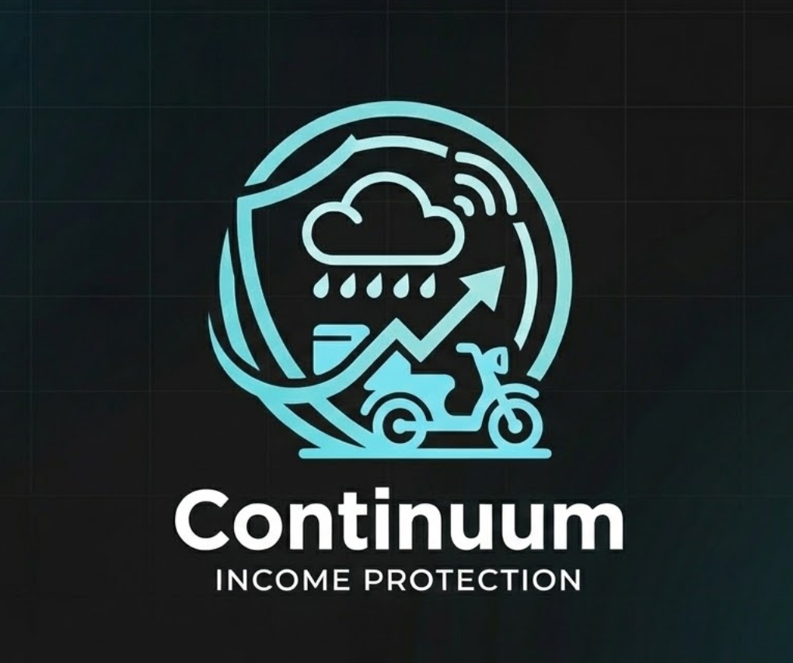
  <br />

  [](#)
  [](#)
  [](#)

  <br />

  **[Demo Video](#)** &nbsp;(Coming Soon)&nbsp; | &nbsp;**[Pitch Deck](#)** &nbsp;(Coming Soon)

  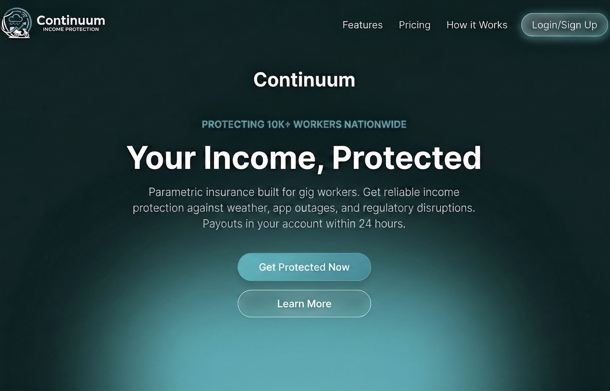
</div>

---

## The Problem

> One storm. One app outage. One week of lost income.

For gig delivery partners on Zomato and Swiggy, income is fragile. There are no sick days, no employer safety nets, and no recourse when the platform goes down at peak hours or rain makes roads unnavigable. A single disruption can wipe out a week's earnings — and filing a traditional insurance claim takes days, not minutes.

## The Solution

**Continuum** protects gig delivery partners from losing income during events they can't control — app outages, severe weather, municipal lockdowns. It detects the disruption automatically, validates it in real time, and pays out directly to the partner's UPI wallet — before they even file a complaint.

Continuum is strictly scoped to **loss of income protection** only. It is not vehicle insurance, medical cover, or life insurance. By replacing subjective claims processing with rule-based, parametric triggers, payouts are executed autonomously the moment a verified disruption occurs — with a weekly micro-premium aligned to the partner's own weekly payout cycle.

## How Continuum Works

The engine behind this promise is fully deterministic — no adjuster, no form, no phone call.

Continuum relies on highly deterministic data oracles to eradicate the claims investigation phase entirely.

### Primary Data Oracles

* **Meteorological:** API integrations with the India Meteorological Department (IMD) and hyper-local weather nodes to track rainfall volume, wind speed, and extreme temperature anomalies.
* **Technological:** Programmatic scraping of Downdetector and synthetic ping monitoring of Zomato/Swiggy delivery/order-routing APIs to detect systematic outages.
* **Regulatory:** Automated parsing of municipal advisory RSS feeds governing lockdown measures or localized curfews.

When all three signals converge above threshold, the payout is queued — autonomously.

At a glance, here is how the stack connects end to end:

<div align="center">
  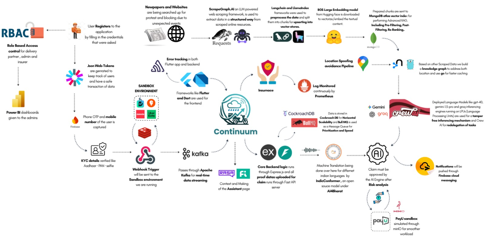
</div>

## Who We Built This For

This isn't a theoretical product. The triggers above were designed around real income patterns from real partners.

**Persona:** The Food Delivery Partner (Swiggy / Zomato Fleet)

Our core personas are grounded in **primary field research** — structured interviews conducted with **3 active Swiggy delivery partners** — revealing massive income volatility and outsized exposure to structural platform penalties. Raw interview recordings are available for review: **[🎙️ User Interview Recordings (Google Drive)](https://drive.google.com/drive/folders/1pVeuibqcbkzK8ll4A9IWnUjMeMUlhQXv)**.

* **The Power User (Sudarshan):** Works exhaustive 17-hour shifts (e.g., 45-50 orders/day) generating ~₹3,000 gross (₹2,100 net after fuel and food). Highly exposed to the platform's strict **₹250 penalty** for failed deliveries, disproportionately punitive given their operational volume.
* **The Full-Time Earner (Dakshina Moorthy):** Operates on grueling 15-hour schedules (8 AM - 11 PM), moving ~30 orders/day. They noted that platform penalties frequently equal or exceed the total earnings of a single order, highlighting a fragile risk-to-reward ratio.
* **The Part-Time Operator (Sudha):** Works focused 8-hour blocks for ~20 orders/day, earning ₹700-₹800. These participants specifically articulated a need for a deterministic safety net against generalized operational shutdowns, such as localized municipality strikes or severe urban waterlogging (floods).

* **Economic Profile:** Relies entirely on daily active hours for income. Highly sensitive to downtime. Operates on weekly aggregate payouts.
* **Operational Geography:** Hyper-local, constrained to specific municipal zones.
* **Risk Exposure:** 100% exposed to environmental, technological, and regulatory disruptions without traditional employment benefits, compounded by outsized punitive frameworks for unfulfilled orders.

### Scenario 1: Hyper-Local Application Outage

* **Disruption:** The regional Swiggy merchant order assignment API experiences a catastrophic 3-hour downtime during the peak Friday dinner rush.
* **Continuum Response:** Continuum’s oracle networks detect the downtime via Downdetector scraping and localized API latency checks. The anomaly is verified, and the parametric threshold is breached. Partner accounts active in the affected geolocation automatically receive a proportional wage-loss payout directly to their registered UPI wallets before the app is restored.

### Scenario 2: Severe Meteorological Event

* **Disruption:** A sudden, unforecasted torrential downpour and localized waterlogging in the partner's active delivery zone trigger a municipal "Red Alert," making physical delivery impossible.
* **Continuum Response:** The IMD Weather API oracle registers rainfall exceeding 50mm within a 2-hour window in the specific geographical polygon. The contract executes automatically, compensating the partner for the anticipated lost hours, allowing them to seek shelter safely without financial penalty.

## The Economics

Traditional insurance utilizes annual or monthly premiums, fundamentally misaligning with gig worker cash flows. Continuum enforces a strictly **Weekly Premium Cycle** governed by a precise economic heuristic.

* **"The One-Order Rule":** Continuum’s core pricing logic dictates that the weekly premium must mathematically equal the approximate earnings of just 1 to 2 successful deliveries. For example, a ₹49-₹99 weekly premium aligns instantly with the cognitive model of a delivery partner, framing the safety net as the cost of a single missed order rather than a burdensome financial liability.
* **Cash Flow Alignment:** Premiums are deducted on a timeline identical to the Zomato/Swiggy weekly payout cadence, abstracting the cognitive load of large upfront payments.
* **Dynamic Risk Rating:** The premium is recalculated every week using predictive modeling. For example, premiums marginally adjust based on the 7-day meteorological forecast for the partner's specific operating zone.
* **Micro-Transactions:** Payments are structured as high-frequency, low-denomination micro-premiums, reducing the barrier to entry to near zero.

Three tiers map directly to a partner's weekly order volume:

<div align="center">
  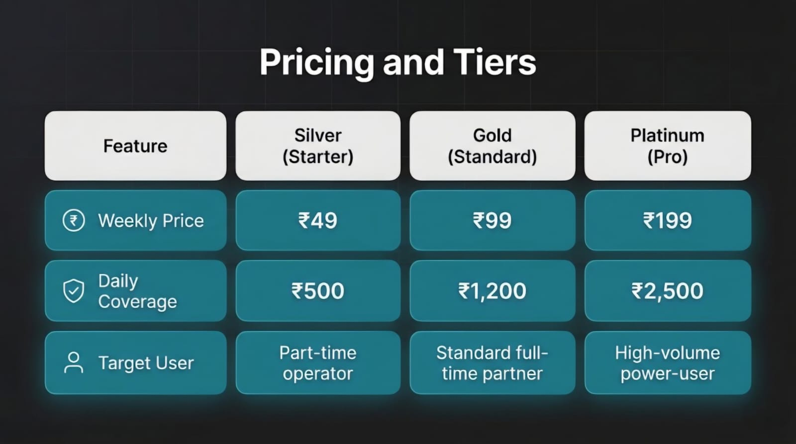
</div>

## The App Experience

The partner never sees any of the oracle complexity. They see this.

<div align="center">
  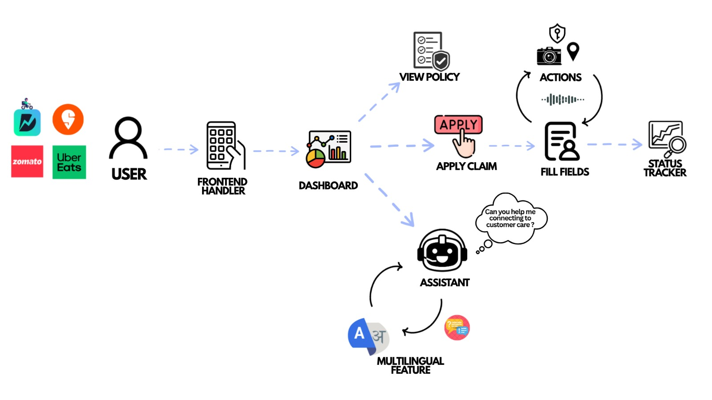
</div>

<br />

<div align="center">

| | | |
|:---:|:---:|:---:|
| 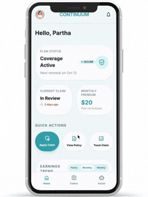 | 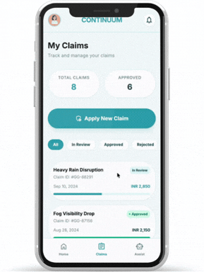 | 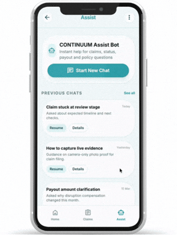 |
| | | |
| 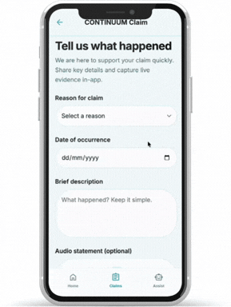 | 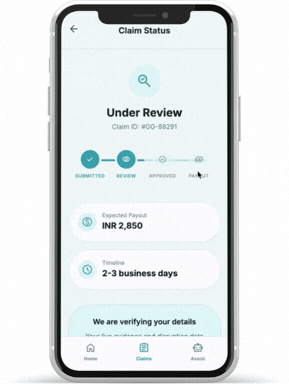 | 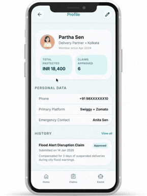 |

</div>

### Built for the Field

* **Mobile-first for real field constraints:** Food delivery partners run the job from their phones. Flutter keeps the UI responsive on budget devices (₹8k–₹15k).
* **Safety-critical notifications in real time:** When a verified disruption triggers a payout, partners get instant lock-screen alerts via Firebase Cloud Messaging.
* **Shipped fast across Android and iOS:** A single Flutter codebase and hot reload let us prototype and deploy within the hackathon timeline—without doubling engineering cycles.
* **Offline resilience for unreliable connectivity:** Offline-first persistence (Hive/SQFlite) keeps premium deductions and submissions reliable, syncing safely when the network returns.

## Intelligence Layer

Behind the interface, two ML pipelines run autonomously on every premium cycle and every claim.

Continuum moves beyond static actuarial tables, deploying ML models for active risk assessment and fraud prevention.

**Risk Profile Engine** — Gradient Boosting model consuming TimescaleDB historical weather, live Weather API data, and worker activity to dynamically price each partner's weekly premium:

<div align="center">
  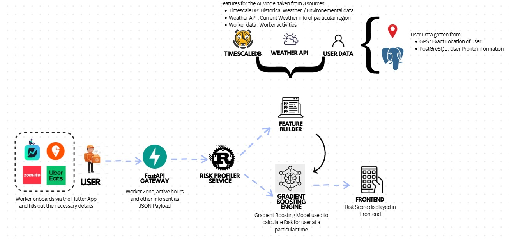
</div>

<br />

**Claims Scoring Pipeline** — Isolation Forest anomaly detection that auto-approves clean claims (score ≥ 0.7) and routes suspicious ones to the fraud queue:

<div align="center">
  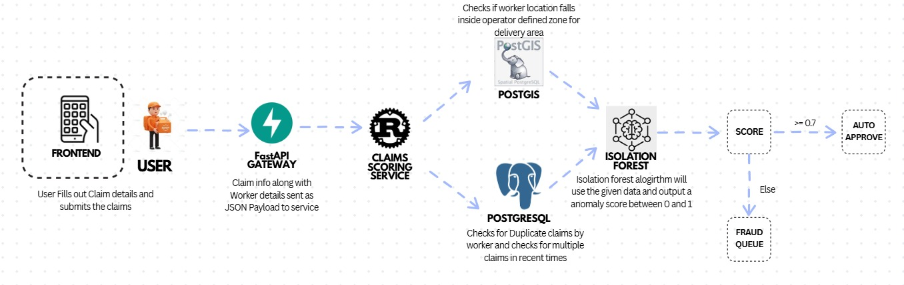
</div>

## System Architecture

The full stack is purpose-built for financial-grade reliability at gig-worker scale. The diagram above shows the end-to-end topology; the table below breaks it down layer by layer.

Every layer was chosen to serve a specific reliability, performance, or compliance constraint:

| Layer | Technology | Role |
|---|---|---|
| **Frontend** | Flutter, Dart | Cross-platform mobile app (Android primary, iOS secondary) |
| **Auth & Identity** | RBAC, JWT, Firebase (Phone OTP), Aadhaar/PAN KYC | Role-based access for partner / admin / insurer; biometric & KYC verification |
| **Core Backend** | Express.js (Node.js) | REST API server — primary business logic, policy and user services |
| **Claims API** | FastAPI (Python) | Handles proof data upload and claim processing pipeline |
| **Message Queue** | Apache Kafka | Real-time data streaming for webhook triggers and oracle events |
| **Task Queue** | Bull MQ | Prioritized background job processing (payout retries, notification dispatch) |
| **Database** | CockroachDB | Distributed SQL — horizontally scalable, ACID-compliant financial ledger |
| **Vector Store** | MongoDB Atlas (Vector Index) | Advanced RAG with Pre-Filtering, Fast-Filtering, and Re-Ranking |
| **Embeddings** | BGE-Large (HuggingFace) | Text vectorization for RAG knowledge base |
| **RAG Orchestration** | LangChain + LlamaIndex | Data preprocessing, chunking, and vector upsert pipeline |
| **Web Intelligence** | ScrapeGraph.AI | LLM-powered structured scraping of news and municipal advisory sources |
| **Knowledge Graph** | Go (caching layer) | Location-aware knowledge graph built from scraped disruption data |
| **AI / LLM Engine** | Gemini (gemini-1.5-pro), Groq, GPT-4o | Inference engine for fraud scoring, risk analysis, claim validation |
| **Agent Orchestration** | Crew AI | Multi-agent task delegation for autonomous claim pipeline steps |
| **Conversational AI** | RASA + Fi | In-app assistant — context-aware partner support bot |
| **Multilingual NLP** | IndicConformer (AI4Bharat) | Machine translation for regional Indian languages |
| **Payments** | PayU Sandbox (via minIO) | Simulated UPI payout disbursement with smoother workload distribution |
| **Push Notifications** | Firebase Cloud Messaging | Real-time lock-screen alerts on payout and disruption events |
| **Monitoring** | Prometheus | Continuous log monitoring and alerting across all services |
| **Admin Dashboard** | Power BI | Business intelligence dashboards for admins and insurers |
| **Environment** | Sandbox (Flutter/Dart) | Isolated development environment for safe end-to-end simulation |

## Trust Architecture

A system that pays automatically without human review is a system that adversaries will probe. Here is how Continuum is hardened.

> **Threat Model:** A coordinated fraud ring of 500 delivery partners uses consumer-grade GPS spoofing applications to simultaneously position themselves inside a flood-triggered payout zone. Simple GPS verification is insufficient. This section documents a layered, deterministic defense architecture hardened against this specific attack vector and 99 analogous failure modes.

<div align="center">
  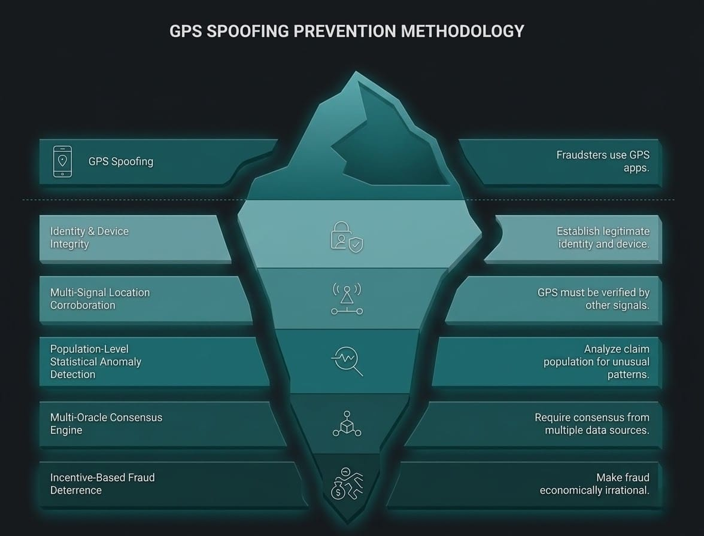
</div>

### The Core Insight: GPS is Necessary, Not Sufficient

A single GPS coordinate is a claim, not proof. Every payout gate in Continuum requires **corroborating evidence from independent signal layers**. A fraudster who can fake one layer almost never controls all of them simultaneously.

### Layer 1 — Identity & Device Integrity

The first perimeter. A fraudster who cannot establish a legitimate identity cannot participate.

* **1:1 Device Binding:** Each Policy ID is cryptographically bound to a unique device fingerprint (Device_ID). A second policy registration on the same device is rejected at the database constraint level; no application-layer logic can override this.
* **National KYC Linkage:** Aadhaar/PAN verification enforces a 1:1 mapping between national identity and active policy count. Family-member account farming is structurally impossible within this constraint.
* **Play Integrity API / SafetyNet Attestation:** Android emulators and rooted devices lack valid hardware attestation certificates. Claims from non-attested devices are automatically ineligible. The platform periodically re-attests devices on the background to catch post-enrollment compromise.
* **Biometric Liveness on Claim Submission:** A randomized biometric face-scan challenge is injected at claim submission, defeating both account-lending schemes and static-ID theft. The liveness detection module specifically flags deepfake-generated video via a dedicated third-party API (e.g., iProov), cross-referencing blink patterns and micro-lighting artifacts that generative models fail to replicate consistently.

### Layer 2 — Multi-Signal Location Corroboration

GPS coordinates must be corroborated by at least two independent signals before location is considered verified.

* **Cellular Network Triangulation (Cell-ID):** If the GPS coordinate and the Cell-ID triangulation mismatch by more than 2km, the location claim is flagged. A spoofing app can inject a false GPS position into the OS; it cannot simultaneously spoof the carrier-reported Cell-ID from the cellular basestation.
* **The Soak Period Requirement:** A partner must have been GPS-verified inside the target polygon for a minimum of **45 continuous minutes before** the parametric trigger fires. Pre-trigger positioning (driving into the zone seconds before a known alert) is thus structurally unrewarded.
* **Temporal Ping Consistency:** Location is sampled across a minimum of 3 independent timestamps within the disruption window. A single fraudulent ping is insufficient. Coordinate velocity = 0 for extended periods (static lock at a fixed address) triggers an automatic eligibility suspension.
* **Delivery Platform Cross-Reference:** If the Swiggy/Zomato API reports that a partner *completed* one or more orders during the stated disruption window, the payout claim is vetoed. A partner cannot be both "unable to work due to disruption" and simultaneously transacting on the platform. This cross-reference is a hard, unappealable veto.

### Layer 3 — Population-Level Statistical Anomaly Detection

The most powerful anti-fraud signal is not found by examining individual claims — it is found by examining the **population of claims simultaneously**.

* **Geographic Convergence Alert:** If ≥50 unique policy IDs file claims pointing to an identical or near-identical lat/long polygon within a 5-minute window, the zone triggers an automatic **"Convergence Freeze"**. All pending claims for that zone are queued for a mandatory 24-hour review hold before any payout is released. A genuine flood will affect the zone gradually; 500 fraudsters converging instantaneously is a statistical signature unique to coordinated rings.
* **Social Graph Clustering:** Device-level Bluetooth and WiFi proximity logs are analyzed at the time of claim. Claims from a cluster of devices that have been in close physical proximity over the prior 7 days (indicative of a coordinated group) are flagged for elevated review. Genuine partners stranded in a flood zone may be near each other, but they did not spend the prior week in the same room.
* **Velocity Limiting:** A maximum of **3 successful claims per policyholder per 90-day rolling window** is enforced. Chronic super-claimants who exceed this threshold are moved to a mandatory manual review hold, regardless of the technical validity of individual claims.

### Layer 4 — Multi-Oracle Consensus Engine

No single data source can unilaterally authorize a payout. Trigger events require a weighted **3-of-4 oracle consensus**.

* **Oracle Vote Architecture:** 4 independent data oracles vote on whether a qualifying event has occurred: (1) IMD Primary API, (2) Private Weather Network (e.g., AccuWeather commercial feed), (3) Satellite Precipitation Data (NASA GPM API), (4) Ground-level sensor aggregation. A trigger requires a minimum of 3 affirmative votes. A single compromised or failed data source cannot cause a payout.
* **Stale Data Handling:** Oracle data carries a maximum TTL of 15 minutes. Data exceeding this TTL is treated as an **oracle abstention**, not a vote. An abstaining oracle does not vote "yes."
* **Certificate Pinning on All Oracle Endpoints:** All HTTPS calls to external data APIs are protected by certificate pinning. An unexpected certificate (indicative of a man-in-the-middle attack or DNS hijack) causes the oracle's vote to be automatically nullified for that polling cycle.
* **Randomized Poll Scheduling:** Oracle polling intervals are randomized within a ±8 minute window around the base cron schedule. This schedule is never exposed externally, making it computationally infeasible to time fraudulent activity to the exact millisecond between sensor checks.

### Layer 5 — Incentive-Based Fraud Deterrence

Structural policy design that makes fraud economically irrational.

* **72-Hour Activation Delay:** New policy enrollments have a 72-hour waiting period before claim eligibility activates. Same-day enrollment and same-day claims are architecturally impossible.
* **5-Day Tier-Upgrade Waiting Period:** Tier upgrades (e.g., Silver → Platinum) do not take effect for claim purposes until 5 days after the upgrade is processed. Pre-event opportunistic coverage escalation yields zero payout advantage.
* **Cancellation Cycle Lock:** Policy cancellations are not effective until the current 7-day billing cycle completes. A partner cannot cancel mid-week after a disruption event is publicly announced.
* **Referral Reward Delay:** Referral bonuses are withheld until the referred partner completes 60 days with zero claims. This destroys the economics of referral-farming fraud rings.

### How We Distinguish a Genuine Stranded Worker from a Fraudster

| Signal | Genuine Partner | Fraud Ring Member |
| ------ | --------------- | ----------------- |
| Device Attestation | Valid hardware cert | Emulator / rooted device |
| GPS + Cell-ID Match | < 500m divergence | Often > 2km divergence |
| Soak Period Compliant | In zone ≥ 45 min pre-trigger | Arrived post-trigger announcement |
| Platform Order History | Zero orders during disruption | May show completed orders |
| Claim Population Density | Distributed across zone | Statistically converged on identical polygon |
| Claim Velocity | ≤ 1 claim per event | Multiple claims in short window |
| Device Proximity History | No prior group clustering | Devices co-located in prior 7 days |

> No single signal is decisive. The genuine partner passes every layer. The fraud ring member cannot simultaneously clear all seven.

---

Anti-fraud is one half of system trust. The other half is deterministic behavior at the boundary conditions where parametric systems typically fail.

### Payout Edge Cases & Fallback Logic

A parametric system is only as trustworthy as its edge-case handling. Three categories of boundary conditions are handled deterministically:

<div align="center">
  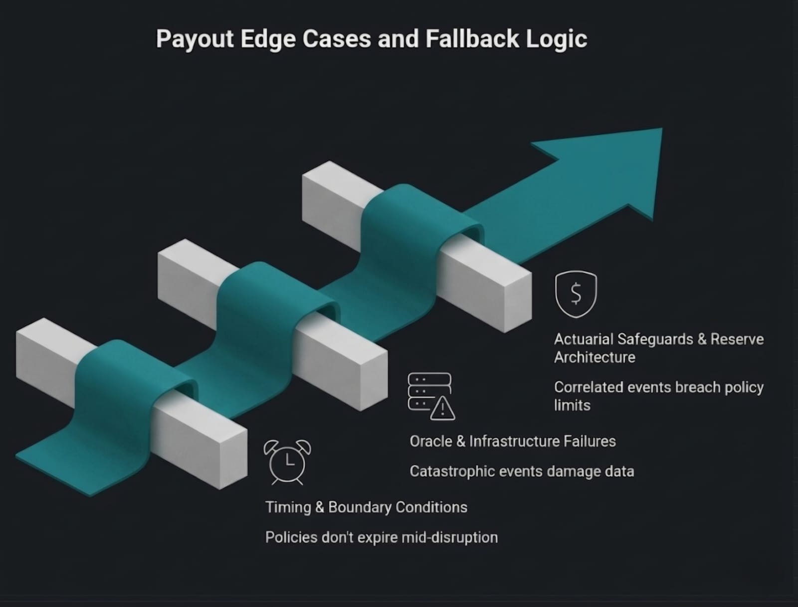
</div>

<br />

### Timing & Boundary Conditions

* **Trigger fires at 11:59 PM on last day of policy week:** If a parametric trigger fires while the policy is technically active—even by 1 minute—the full week's coverage benefit is honored. Policies do not expire mid-disruption.
* **Partner in adjacent, non-triggered zone is also stranded:** Partners in zones immediately bordering a triggered polygon receive a **50% pro-rated payout** (the "Adjacency Grace" rule), acknowledging that physical disruption is not confined to administrative polygon boundaries.
* **Partner's GPS centroid spans two municipal boundaries:** Payout is calculated against the municipality containing the GPS centroid, not the zone with the higher coverage value. Partial-zone events pay 50% if the centroid falls within the affected region.
* **Two qualifying disruptions occur within the same 7-day policy cycle:** A hard cap of **one successful payout per 7-day policy cycle** applies, regardless of the number of distinct parametric triggers that fire. This constraint is foundational to actuarial solvency.

### Oracle & Infrastructure Failures

* **≥2 of 4 oracles are offline simultaneously during a verified disaster:** When a catastrophic event physically damages data infrastructure, the system applies a **"Benefit of Doubt" protocol**: a capped 50% payout is automatically authorized for all active policies in the affected zone if at least 1 oracle confirms the event and 2+ are confirmed offline. Waiting for full oracle consensus during a disaster is a design failure.
* **UPI/NPCI payment rails go down nationally:** All valid payouts are queued in an immutable ledger and auto-retried with exponential backoff. A Razorpay-held wallet escrow serves as an interim reserve for partners who require immediate liquidity.
* **Partner's UPI number is compromised via SIM swap:** All payout disbursements are subject to a **6-hour SIM-change cooling period**. Any account with a recent SIM change requires biometric re-confirmation before funds are released.

### Actuarial Safeguards & Reserve Architecture

* **Correlated catastrophic event (cyclone, earthquake) affects >1,000 simultaneous policies:** A mandatory reinsurance treaty is activated for any single event breaching the 1,000-simultaneous-policyholder threshold. This is the capital backstop that prevents catastrophic liquidity events from invalidating all outstanding policies.
* **Zone-specific loss ratio exceeds 80% for 4 consecutive weeks:** The dynamic pricing engine triggers an automatic premium escalation for that specific zone. Partners in the zone are notified 7 days in advance of premium changes. This is the real-time actuarial feedback loop.
* **Minimum 90-day reserve requirement:** IRDAI-mandated solvency margins require Continuum to hold a minimum 90-day payout reserve in escrow at all times, held exclusively in RBI-approved low-risk liquid instruments (e.g., Treasury bills, money market funds). Zero equity exposure is permitted on reserve capital.

---

## Getting Started

The following sets up the full Continuum stack locally.

### Prerequisites

* [Flutter SDK](https://docs.flutter.dev/get-started/install) >= 3.19
* Node.js >= 20.x
* Python >= 3.11
* PostgreSQL >= 15

### 1. Clone the Repository

```bash
git clone https://github.com/your-org/continuum.git
cd continuum
```

### 2. Backend Setup

```bash
cd backend
npm install
cp .env.example .env   # configure DB and API keys
npx prisma migrate dev
npm run dev            # starts REST API on :3000
```

### 3. Python ML & Oracle Services

```bash
cd ml
pip install -r requirements.txt
uvicorn main:app --reload  # FastAPI pricing/fraud service on :8000
```

### 4. Flutter App

```bash
cd mobile
flutter pub get
flutter run             # targets connected device or emulator
```

---

<div align="center">
  <em>Continuum turns income protection from a privilege into a default — available to every delivery partner, activated before they even know they need it. Built for the Devtrails Guidewire Hackathon.</em>
</div>
